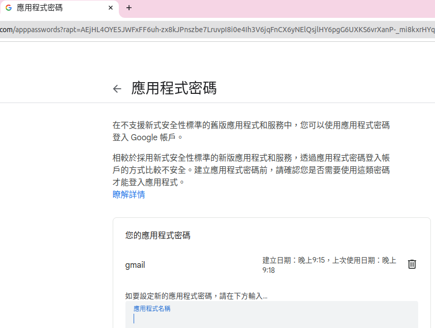

# auth-backend

This repostiory is use nestjs guard component to implements authentication and authorization

## dependency

1. mongoose

```shell
pnpm add -S @types/mongoose mongoose
```
2. class-validator, class-transformer for data validation
```shell
pnpm add -S class-validator class-transformer
```
3. @nestjs/jwt
```shell
pnpm add -S @nestjs/jwt
```


## step 1

setup user schema

```typescript
import { Prop, Schema, SchemaFactory } from '@nestjs/mongoose';
@Schema()
export class User extends Document {
  @Prop({ required: true })
  name: string;

  @Prop({ required: true, unique: true })
  email: string;

  @Prop({ required: true })
  password: string;
}

export const UserSchema = SchemaFactory.createForClass(User);
```

## setup validationPipe for all route

```typescript
import { NestFactory } from '@nestjs/core';
import { AppModule } from './app.module';
import { ValidationPipe } from '@nestjs/common';
async function bootstrap() {
  const app = await NestFactory.create(AppModule);
  app.useGlobalPipes(
    new ValidationPipe({
      whitelist: true,
      forbidNonWhitelisted: true,
    }),
  );
  await app.listen(3000);
}
bootstrap();
```

## add mongooseModule into app module

```typescript
import { Module } from '@nestjs/common';
import { AppController } from './app.controller';
import { AppService } from './app.service';
import { AuthModule } from './auth/auth.module';
import { MongooseModule } from '@nestjs/mongoose';
import { ConfigModule, ConfigService } from '@nestjs/config';
import * as Joi from 'joi';
@Module({
  imports: [
    ConfigModule.forRoot({
      isGlobal: true,
      envFilePath: ['.env', '.env.local'],
      validationSchema: Joi.object({
        MONGO_URI: Joi.string().required(),
      }),
    }),
    MongooseModule.forRootAsync({
      inject: [ConfigService],
      useFactory: (configService: ConfigService) => {
        return {
          uri: configService.get<string>('MONGO_URI'),
        };
      },
    }),
    AuthModule,
  ],
  controllers: [AppController],
  providers: [AppService],
})
export class AppModule {}

```

## notice smtp server 部份

這次因為 sendgrid 帳號太久沒使用導致 帳號被 suspend

所改成使用 google 的 smtp server

順便查詢使用建立 google 應用程式密碼的方式



透過這種方式就可以使用 smtp.google.com 這個 host

port 是 465 協定需要通過 TLS/SSL 加密通道

## 特別要提的點

1. 這次忘記密碼的 token 與 userid 是透過 mongodb 的 storage 去存儲

2. 重設密碼的 token 與 userid 也是透過 mongodb 去儲存

這並且兩都在使用結束後就刪除

其中該思考的點是建立帳戶的流程兩個流程對於 db 的查詢與更新具有相依性，也許該找出可以不依賴於資料庫狀態的作法。